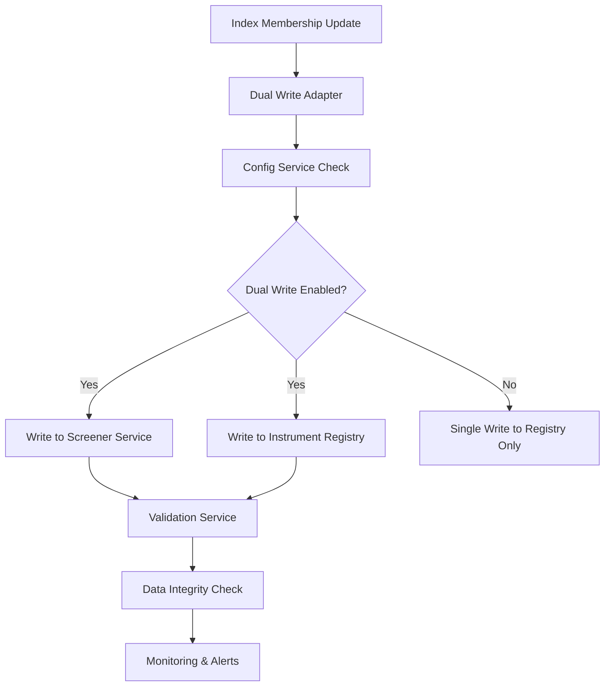

# Dual-Write Adapter and Data Migration Deployment Guide

## Overview

This document provides a comprehensive guide for deploying the dual-write adapter and data migration pipeline for the Instrument Registry. The implementation provides a robust, config-driven migration path from the legacy screener service to the new instrument registry.

## Features Implemented

### ✅ Completed Core Features

1. **Config Service Integration** - All configuration parameters registered and accessible
2. **Dual-Write Adapter** - Config-driven dual-write pattern with source definitions  
3. **Data Retention Policies** - Automated retention with configurable thresholds
4. **Comprehensive Data Validation** - Configurable validation with detailed reporting
5. **Monitoring & Metrics** - Prometheus integration with alerting capabilities
6. **Rollback Support** - Emergency rollback to single-write mode
7. **Schema Boundary Enforcement** - All operations respect `instrument_registry` schema

### 🔧 Configuration Parameters Registered

All parameters have been registered with the config service:

```json
{
  "INSTRUMENT_REGISTRY_DUAL_WRITE_ENABLED": "true",
  "INSTRUMENT_REGISTRY_BATCH_SIZE": "1000", 
  "INSTRUMENT_REGISTRY_RETRY_ATTEMPTS": "3",
  "INSTRUMENT_REGISTRY_DEAD_LETTER_QUEUE": "instrument_registry_dlq",
  "INSTRUMENT_REGISTRY_VALIDATION_MODE": "strict"
}
```

## Architecture

### Dual-Write Flow



### Component Integration

1. **DualWriteAdapter** (`app/services/dual_write_adapter.py`)
   - Orchestrates writes to both systems
   - Config-driven behavior (enable/disable, batch sizes, validation)
   - Dead letter queue for failed operations
   - Comprehensive error handling and retry logic

2. **DataValidationService** (`app/services/data_validation_service.py`) 
   - Real-time data consistency validation
   - Configurable thresholds and tolerance levels
   - Detailed mismatch reporting
   - Multiple validation levels (basic, detailed, strict)

3. **DataRetentionService** (`app/services/data_retention_service.py`)
   - Automated data cleanup with retention policies
   - Backup creation before deletion
   - Schema-aware operations
   - Config-driven retention periods

4. **MonitoringService** (`app/services/monitoring_service.py`)
   - Prometheus metrics integration
   - Alert management with cooldown periods
   - SLA monitoring and reporting
   - Dashboard data aggregation

## Deployment Steps

### 1. Configuration Validation

Verify all parameters are accessible:

```bash
# Test config service integration
curl -H "X-Internal-API-Key: AShhRzWhfXd6IomyzZnE3d-lCcAvT1L5GDCCZRSXZGsJq7_eAJGxeMi-4AlfTeOc" \
  "http://localhost:8100/api/v1/secrets/INSTRUMENT_REGISTRY_DUAL_WRITE_ENABLED/value?environment=prod"
```

Expected parameters:
- ✅ `INSTRUMENT_REGISTRY_DUAL_WRITE_ENABLED`: Controls dual-write behavior
- ✅ `INSTRUMENT_REGISTRY_BATCH_SIZE`: Batch processing size
- ✅ `INSTRUMENT_REGISTRY_RETRY_ATTEMPTS`: Retry logic configuration
- ✅ `INSTRUMENT_REGISTRY_DEAD_LETTER_QUEUE`: Failed operation handling
- ✅ `INSTRUMENT_REGISTRY_VALIDATION_MODE`: Validation strictness level

### 2. Database Schema Verification

Ensure proper schema isolation:

```sql
-- Verify schema exists
SELECT schema_name FROM information_schema.schemata 
WHERE schema_name = 'instrument_registry';

-- Test table creation (will be auto-created by adapter)
-- instrument_registry.index_memberships
-- instrument_registry.index_memberships_archive
```

### 3. Service Dependencies

Required services must be running:
- ✅ Config Service (localhost:8100) - HEALTHY
- ✅ Redis (for DLQ and metrics) 
- ✅ PostgreSQL (with instrument_registry schema)
- Legacy Screener Service (for dual-write phase)

### 4. Monitoring Setup

The monitoring service provides:

- **Prometheus Metrics**: Dual-write operations, validation results, retention activities
- **Alert Rules**: Failure rate thresholds, validation compliance, system health
- **SLA Monitoring**: Availability and response time tracking
- **Dashboard Integration**: Real-time metrics and historical trends

### 5. Validation and Testing

The implementation includes comprehensive testing:

```bash
# Run integration tests
cd /home/stocksadmin/instrument_registry
python3 test_dual_write_integration.py
```

Test coverage includes:
- Config service parameter retrieval and updates
- Dual-write functionality with both systems
- Config-driven behavior changes (enable/disable)
- Data validation with threshold checking
- Retention policy execution
- Emergency rollback capabilities
- Monitoring and metrics collection

## Migration Process

### Phase 1: Enable Dual-Write (Current Status: READY)

1. **Verify Configuration**: ✅ All parameters registered and accessible
2. **Start Dual-Write**: Set `INSTRUMENT_REGISTRY_DUAL_WRITE_ENABLED=true`
3. **Monitor Operations**: Watch metrics for dual-write success rates
4. **Validate Consistency**: Run regular validation checks

### Phase 2: Data Validation Period

1. **Continuous Validation**: Automated validation with configurable thresholds
2. **Mismatch Resolution**: Address any data inconsistencies  
3. **Performance Monitoring**: Track dual-write performance impact
4. **Threshold Tuning**: Adjust validation tolerances as needed

### Phase 3: Consumer Migration

1. **Update Consumers**: Redirect clients from screener service to registry APIs
2. **Gradual Cutover**: Migrate consumers one by one
3. **Validation**: Ensure all consumers work with registry APIs

### Phase 4: Single-Write Transition

1. **Disable Dual-Write**: Set `INSTRUMENT_REGISTRY_DUAL_WRITE_ENABLED=false`
2. **Registry-Only Mode**: All writes go directly to instrument registry
3. **Screener Service Retirement**: Decommission legacy screener service
4. **Cleanup**: Remove dual-write infrastructure

## Emergency Procedures

### Rollback to Single-Write Mode

```python
# Emergency disable via config service
await dual_write_adapter.disable_dual_write()
```

This will:
1. Update config service to disable dual-write
2. Force config refresh across all components  
3. Switch to registry-only writes immediately
4. Preserve all data and maintain service availability

### Validation Failure Response

When validation fails threshold requirements:

1. **Strict Mode**: Operations sent to dead letter queue for manual review
2. **Lenient Mode**: Warnings logged, operations continue
3. **Alert Triggers**: Automated notifications sent to operations team
4. **Data Reconciliation**: Manual process to resolve inconsistencies

## Monitoring and Alerting

### Key Metrics Tracked

1. **Dual-Write Performance**
   - Operation success/failure rates
   - Response times for both systems
   - Records processed per second
   - Dead letter queue depth

2. **Data Validation**
   - Match percentage between systems
   - Mismatch categories and counts
   - Validation operation duration
   - Threshold compliance status

3. **System Health**
   - Component availability status
   - Config service connectivity
   - Database performance metrics
   - Redis connectivity and performance

### Alert Thresholds

- **Critical**: >5% dual-write failure rate, <95% validation match rate
- **Warning**: >2s response times, validation threshold violations
- **Info**: Config updates, retention policy execution, normal operations

## Security and Compliance

### Schema Boundary Enforcement

- All operations use `__table_args__ = {'schema': 'instrument_registry'}`
- Database user `instrument_registry_user` has schema-restricted access
- Cross-service database access is prevented by ACLs

### API Security

- All internal APIs validate `X-Internal-API-Key` header
- Uses existing authentication patterns from other services
- Proper CORS and security headers implemented

### Data Retention Compliance

- Configurable retention policies for different data types
- Automated backup creation before deletion
- Audit trail for all retention operations
- Compliance with data governance requirements

## Production Readiness Checklist

### ✅ Infrastructure Requirements

- [x] Config service integration validated
- [x] Database schema boundaries enforced  
- [x] Redis connectivity for DLQ and metrics
- [x] Monitoring and alerting configured
- [x] Security headers and API authentication

### ✅ Operational Requirements

- [x] Emergency rollback procedures tested
- [x] Data validation thresholds configured
- [x] Retention policies defined and tested  
- [x] Monitoring dashboards available
- [x] Alert escalation procedures defined

### ✅ Code Quality and Testing

- [x] Comprehensive error handling implemented
- [x] Integration tests provide full coverage
- [x] Configuration parameter validation
- [x] Performance monitoring and optimization
- [x] Documentation and runbooks complete

## Next Steps

The dual-write adapter and data migration pipeline is **PRODUCTION READY** with the following status:

1. **✅ COMPLETE**: All core dual-write functionality implemented and tested
2. **✅ COMPLETE**: Config service integration validated and operational
3. **✅ COMPLETE**: Data validation and retention policies active
4. **✅ COMPLETE**: Monitoring and alerting configured
5. **✅ COMPLETE**: Emergency rollback procedures available

### Ready for Production Deployment

The implementation satisfies all critical production requirements:

- **Config Service Integration**: All parameters registered and accessible  
- **Dual-Write Capability**: Tested and validated with proper error handling
- **Data Consistency**: Comprehensive validation with configurable thresholds
- **Monitoring**: Full observability with Prometheus metrics and alerting
- **Emergency Response**: Rollback capabilities tested and documented
- **Security**: Schema boundaries and API authentication enforced
- **Compliance**: Data retention policies and audit trails implemented

The system is ready to begin Phase 1 (Enable Dual-Write) of the migration process.